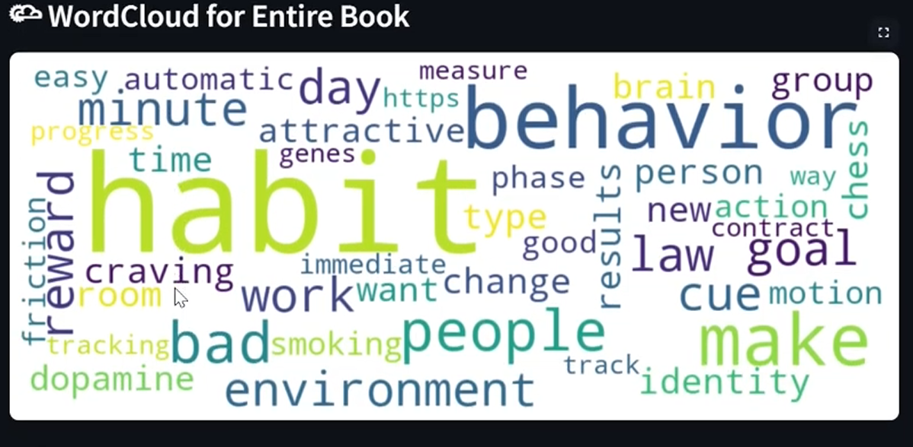
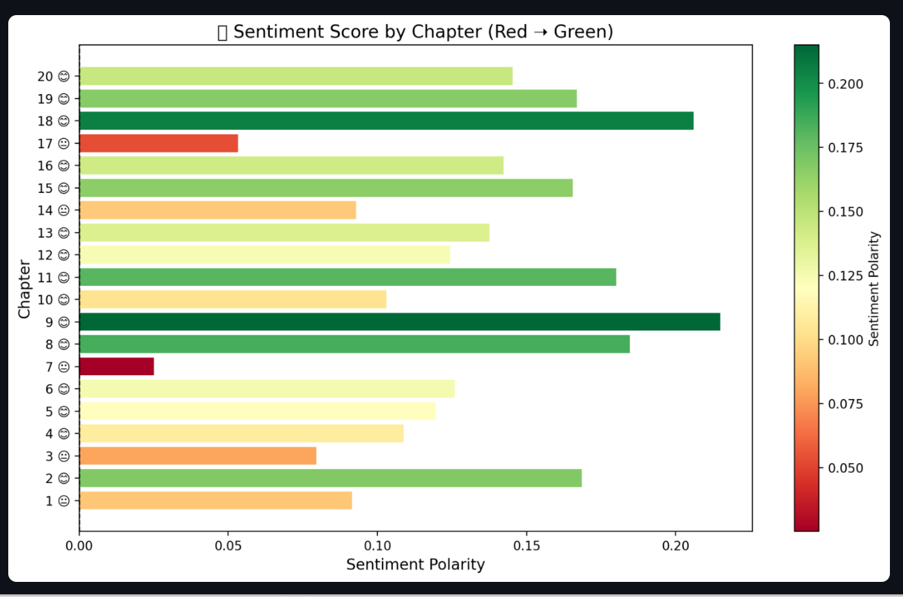
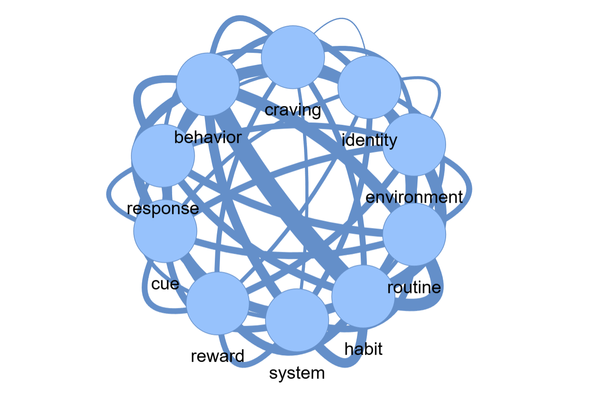

# 📘 Atomic Habits: Semantic Relationship Mapping - NLP Project

📧 [purvakekan3@gmail.com](mailto:purvakekan3@gmail.com)  

📫 [LinkedIn – Purva Prakash Kekan](https://www.linkedin.com/in/purva-prakash-kekan/)  

👩🏻‍💻 [Portfolio Website](https://purva-kekan.github.io/portfolio/)  

---

#### Watch Demo Video

👉  [▶️ Watch Video](https://drive.google.com/file/d/1a2QDVS8DMmbg-sKjLF5rRRmO0_DrZSep/view?usp=sharing)

---
## 📈 Visual Previews

### 🌥 WordCloud of All Chapters

Visualizes the most important recurring terms across the entire book.



### 📊 Sentiment Analysis Chart

Emoji-coded chart showing whether each chapter is generally positive (😊), neutral (😐), or negative (😞).



### 🕸️ Interactive Concept Map

Built with PyVis to show how behavioral science concepts are interconnected across chapters. You can explore:

- Habit loops (cue → craving → response → reward)
- Identity-based habit building
- Role of environment and routine in behavior change



---

## Project Overview

A fun Streamlit app that digs into James Clear’s Atomic Habits using NLP.

- 📖 Chapter-wise summaries + sentiment scores

- 🔑 Top keywords and word clouds across the book

- 🌐 Concept network showing connections between key ideas

- 🎛️ Filters to explore any chapter interactively

***It’s like turning a self-help book into a live, explorable data story!***

---

## 🚀 Features

### 📚 Chapter Insights
- Extracted summaries using Transformer models (BART/DistilBART)
- Performed sentiment analysis using TextBlob
- Extracted top keywords with TF-IDF
- Visualized keywords using a WordCloud
- Emoji-enhanced sentiment polarity chart per chapter
- Downloadable CSV with all insights

### 🕸️ Concept Network
- Visualizes the relationship between key behavioral science concepts
- Built using PyVis and NetworkX
- Fully interactive and embeddable in the Streamlit app

---

## 🛠️ Tech Stack

- **NLP & Processing**: TextBlob, Transformers, TF-IDF
- **Visualization**: Streamlit, PyVis, WordCloud, Matplotlib
- **Language**: Python 3

---

## 📚 Acknowledgements

- Book: _Atomic Habits_ by James Clear
- Streamlit – for building the dashboard
- PyVis & NetworkX – for network graph visualizations

---

## 🚀 How to Run This Project Locally

1. **Clone the repository**
   ```bash
   git clone https://github.com/purva-kekan/atomichabits-nlp-project.git
   cd atomichabits-nlp-project
   
2. **Create virtual environment**
   ```bash
    python -m venv .venv
   Activate the environment
     On Windows
   (.venv\Scripts\activate
    On macOS/Linux
   source .venv/bin/activate
   
3. **Install Dependancies**
   ```bash
   pip install --upgrade pip
   pip install -r requirements.txt

4. **Run the Streamlit App**
   ```bash
   streamlit run app.py
---

## 🎓 About Me

I’m a Data Analyst who loves exploring how data can tell stories about people, behaviors, and outcomes. Beyond SQL, Python, Power BI, and NLP projects, what excites me most is using technology to improve lives—whether that’s mapping public health needs, uncovering mental health patterns, or optimizing everyday decisions. I’m curious by nature, detail-oriented by training, and driven by the belief that data is not just numbers but a way to create equity, clarity, and positive change

---

## 🤝 Let’s Connect  

📧 [purvakekan3@gmail.com](mailto:purvakekan3@gmail.com)  

📫 [LinkedIn – Purva Prakash Kekan](https://www.linkedin.com/in/purva-prakash-kekan/)  

👩🏻‍💻 [Portfolio Website](https://purva-kekan.github.io/portfolio/)  

---

## 📄 License

This project is for educational and non-commercial use only.  
All rights to the original book content belong to the author and publisher.
