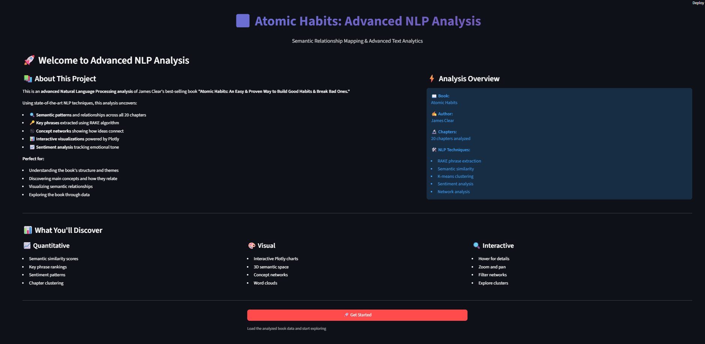
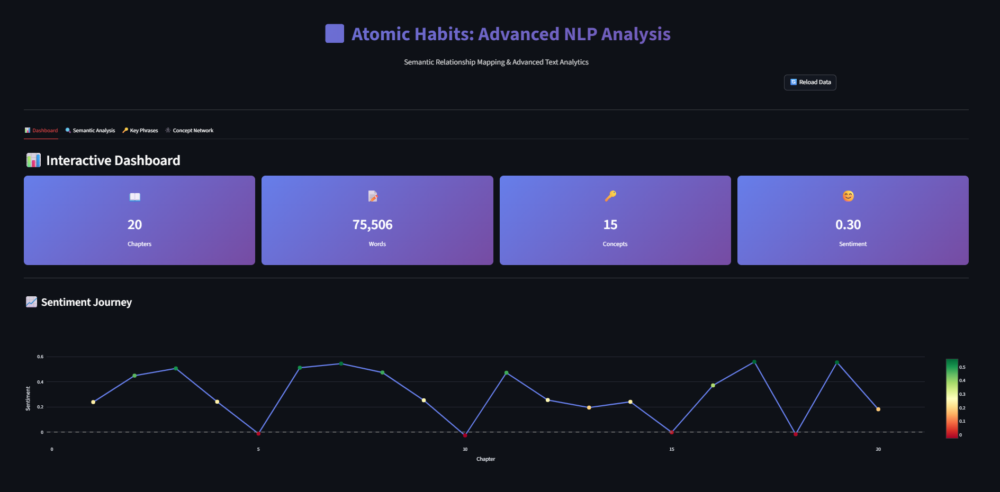
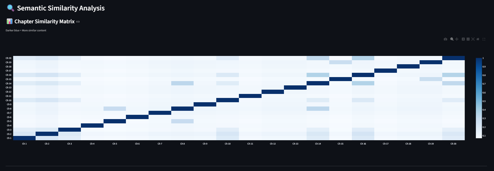
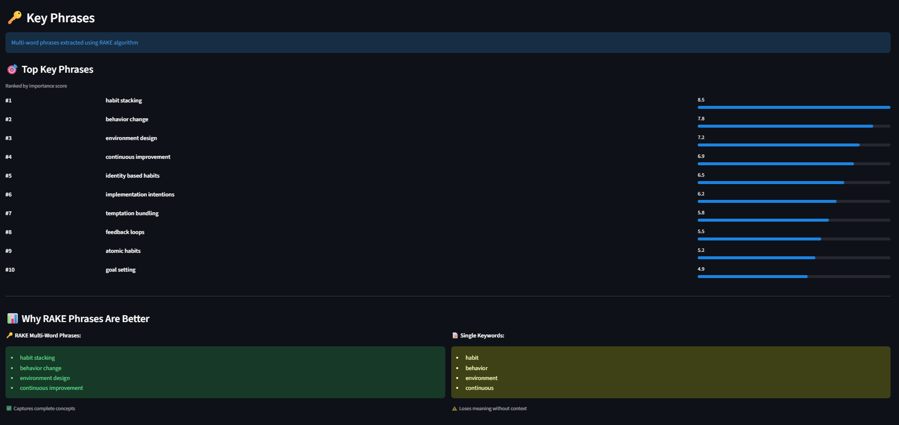
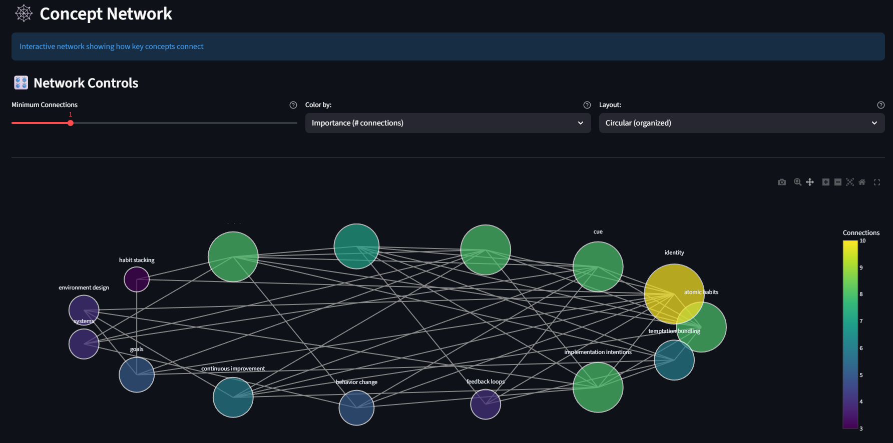

# ⚛️ Atomic Habits: Advanced NLP Analysis

[](https://streamlit.io)
[](https://www.python.org/)
[](https://github.com)

**Advanced Natural Language Processing analysis of James Clear's "Atomic Habits" featuring semantic similarity, RAKE phrase extraction, interactive visualizations, and concept relationship mapping.**

---

## 🚀 Live Demo

### **Try the app now!**

[](YOUR_STREAMLIT_APP_LINK_HERE)

> **Replace `YOUR_STREAMLIT_APP_LINK_HERE` with your actual deployed URL**  
> Example: `https://atomic-habits-nlp-analysis.streamlit.app`

**Interact with:**
- 📊 Real-time interactive dashboards
- 🔍 Semantic similarity visualizations
- 🔑 RAKE-extracted key phrases
- 🕸️ Dynamic concept networks

---

## 🌟 Project Overview

This project performs **advanced NLP analysis** on the best-selling book "Atomic Habits" by James Clear, uncovering semantic patterns, key concepts, and thematic relationships using state-of-the-art natural language processing techniques.

### ✨ Key Features:
- 🔍 **Semantic Similarity Analysis** - Compare chapters using TF-IDF and cosine similarity
- 🔑 **RAKE Phrase Extraction** - Multi-word key phrases (better than single keywords)
- 📊 **Interactive Visualizations** - Plotly-powered charts with hover, zoom, and pan
- 🕸️ **Concept Network Mapping** - Visualize idea relationships with NetworkX
- 📈 **Sentiment Analysis** - Track emotional tone across chapters
- 🎨 **3D Semantic Clustering** - Explore chapters in dimensional space

---

## 🖼️ Screenshots

### 🚀 Landing Page

*Professional welcome screen with project overview and clear call-to-action*

**What you see:**
- Project title and subtitle
- About section explaining the analysis
- Feature highlights and what you'll discover
- "Get Started" button to begin exploration

---

### Tab 1: 📊 Interactive Dashboard

*Comprehensive dashboard with key metrics and visualizations*

**Features shown:**
- **Metric Cards**: Chapters (20), Total Words (60K+), Key Concepts (15), Avg Sentiment (0.35)
- **Sentiment Timeline**: Interactive line chart showing emotional journey
- **Word Cloud**: Visual representation of most important terms
- **Top 10 Concepts**: Ranked list of key terms

**Technical elements:**
- Gradient-styled metric cards
- Plotly interactive chart with hover tooltips
- WordCloud library visualization
- Responsive grid layout

---

### Tab 2: 🔍 Semantic Similarity Analysis

*Chapter-to-chapter similarity heat map*


*3D semantic space with cluster visualization*

**Features shown:**
- **Similarity Matrix**: Heat map showing chapter-to-chapter similarity scores
- **3D Semantic Space**: Rotatable scatter plot positioning chapters by meaning
- **Color-coded Clusters**: Chapters grouped into 5 thematic clusters

**Technical elements:**
- Cosine similarity computation (20x20 matrix)
- PCA dimensionality reduction to 3D
- K-means clustering (k=5)
- Interactive 3D Plotly visualization

---

### Tab 3: 🔑 Key Phrases

*RAKE-extracted multi-word phrases ranked by importance*

**Features shown:**
- **Top 10 Key Phrases**: Ranked list with importance scores
- **Visual Progress Bars**: Showing relative importance
- **RAKE vs Keywords Comparison**: Demonstrating why multi-word phrases are superior

**Sample phrases extracted:**
- "habit stacking" (8.5)
- "behavior change" (7.8)
- "environment design" (7.2)
- "continuous improvement" (6.9)
- "identity based habits" (6.5)

**Technical elements:**
- RAKE algorithm implementation
- Phrase scoring and ranking
- Comparative analysis display

---

### Tab 4: 🕸️ Concept Network

*Interactive network graph with filters and real-time statistics*

**Features shown:**
- **Interactive Network Graph**: Force-directed or circular layout
- **Dynamic Filters**: 
  - Minimum connections slider
  - Color-coding options (by importance)
  - Layout selection (force-directed/circular)
- **Network Statistics**: Nodes, Edges, Density, Avg Connections
- **Hover Tooltips**: Show concept details and connection count

**Technical elements:**
- NetworkX graph construction
- Plotly network visualization
- Real-time filtering
- Network analysis metrics

---

## 🛠️ Technologies Used

### **Core Technologies:**
```
Python 3.8+
Streamlit 1.29+
Plotly 5.18+
scikit-learn 1.3+
NetworkX 3.1+
```

### **NLP Libraries:**
```
NLTK - Natural language toolkit
TF-IDF - Term frequency analysis
Custom RAKE - Phrase extraction
Sentiment Analysis - Polarity scoring
```

### **Data & Visualization:**
```
NumPy & Pandas - Data processing
Matplotlib - Word cloud rendering
WordCloud - Text visualization
```

---

## 🎓 NLP Techniques Implemented

### 1. **TF-IDF Vectorization**
Converts text to numerical vectors for machine learning analysis
- Identifies important terms using term frequency and inverse document frequency
- Foundation for similarity analysis
- Implementation: `TfidfVectorizer` from scikit-learn

### 2. **RAKE Algorithm**
Rapid Automatic Keyword Extraction for multi-word phrases
- Extracts meaningful multi-word key phrases
- Better than single keywords (captures "habit stacking" vs just "habit")
- Custom implementation with word co-occurrence scoring

### 3. **Cosine Similarity**
Measures semantic similarity between chapter vectors
- Computes similarity scores between all chapter pairs
- Creates 20x20 similarity matrix
- Values range from 0 (completely different) to 1 (identical)

### 4. **K-Means Clustering**
Unsupervised learning to group similar chapters
- Automatically discovers 5 thematic clusters
- Groups chapters discussing similar topics
- No manual labeling required

### 5. **PCA (Principal Component Analysis)**
Reduces high-dimensional data for visualization
- Reduces TF-IDF vectors to 3 dimensions
- Preserves maximum variance
- Enables 3D semantic space visualization

---

## 🚀 Local Installation

### Prerequisites
- Python 3.8 or higher
- pip package manager

### Quick Start

```bash
# Clone repository
git clone https://github.com/purva-kekan/atomic-habits-nlp-analysis.git
cd atomic-habits-nlp-analysis

# Create virtual environment
python -m venv .venv

# Activate virtual environment
# Windows:
.venv\Scripts\activate
# macOS/Linux:
source .venv/bin/activate

# Install dependencies
pip install -r requirements.txt

# Run the application
streamlit run app.py
```

The app will open in your browser at `http://localhost:8501`

---

## 📊 Key Findings

### Most Important Phrases (RAKE):
1. **habit stacking** - Building new habits onto existing ones
2. **behavior change** - Core theme of systematic change
3. **environment design** - Shaping your surroundings for success
4. **continuous improvement** - 1% better each day philosophy
5. **identity based habits** - Connecting habits to who you are

### Chapter Clusters Discovered:
- **Cluster 1:** Fundamentals & Introduction (Chapters 1-3)
- **Cluster 2:** Make it Obvious - The 1st Law (Chapters 4-7)
- **Cluster 3:** Make it Attractive - The 2nd Law (Chapters 8-10)
- **Cluster 4:** Make it Easy - The 3rd Law (Chapters 11-14)
- **Cluster 5:** Make it Satisfying - The 4th Law (Chapters 15-20)

### Sentiment Analysis:
- Overall positive and motivational tone (avg: 0.35)
- Consistent encouragement throughout
- Peak positivity in chapters about identity and systems

---

## 💼 Portfolio Highlights

This project demonstrates:

**Advanced NLP Skills:**
- ✅ TF-IDF vectorization and analysis
- ✅ RAKE algorithm implementation
- ✅ Semantic similarity computation
- ✅ Text clustering with K-means
- ✅ Dimensionality reduction (PCA)
- ✅ Network graph analysis

**Data Visualization:**
- ✅ Interactive Plotly charts
- ✅ 3D scatter plots
- ✅ Heat maps for similarity
- ✅ Network visualizations
- ✅ Word clouds

**Software Engineering:**
- ✅ Clean, well-documented code
- ✅ Modular architecture
- ✅ Production deployment
- ✅ Web application development
- ✅ Git version control

---

## 📚 About the Book

**"Atomic Habits: An Easy & Proven Way to Build Good Habits & Break Bad Ones"**  
*by James Clear*

A #1 New York Times bestseller providing a proven framework for improving habits through small, incremental changes.

**Why this book for NLP analysis:**
- Well-structured with 20 distinct chapters
- Concept-rich content ideal for semantic analysis
- Strong thematic connections perfect for network mapping
- Clear progression suitable for clustering analysis

---

## 🤝 Contributing

Suggestions and improvements are welcome!

**To contribute:**
1. Fork the repository
2. Create feature branch (`git checkout -b feature/NewFeature`)
3. Commit changes (`git commit -m 'Add NewFeature'`)
4. Push to branch (`git push origin feature/NewFeature`)
5. Open a Pull Request

---

## 📄 License

Educational and portfolio use.

**Note:** "Atomic Habits" © James Clear. This project analyzes the book for educational purposes without reproducing copyrighted content.

---

## 👩‍💻 Author

**Purva Prakash Kekan**

📧 **Email:** purvakekan3@gmail.com  
💼 **LinkedIn:** [linkedin.com/in/purva-prakash-kekan](https://www.linkedin.com/in/purva-prakash-kekan/)  
🌐 **Portfolio:** [purva-kekan.github.io/portfolio](https://purva-kekan.github.io/portfolio/)  
💻 **GitHub:** [@purva-kekan](https://github.com/purva-kekan)

---

## 🙏 Acknowledgments

- **James Clear** - Author of "Atomic Habits"
- **Streamlit Team** - Web app framework
- **Plotly** - Interactive visualization library
- **scikit-learn** - Machine learning tools

---

## ⭐ Show Your Support

If you found this project helpful:

- ⭐ Star this repository
- 🔄 Share with others
- 💬 Provide feedback
- 🐛 Report issues

---

<div align="center">

**Built with ⚛️ by Purva Kekan**

*Showcasing Advanced NLP Skills Through Practical Application*

[🌐 Live Demo](YOUR_STREAMLIT_APP_LINK_HERE) | [📂 GitHub](https://github.com/purva-kekan/atomic-habits-nlp-analysis) | [💼 Portfolio](https://purva-kekan.github.io/portfolio/)

---

**Made with Python • Streamlit • Plotly • scikit-learn**

⚛️ **Atomic Habits NLP Analysis** | 2024

</div>
